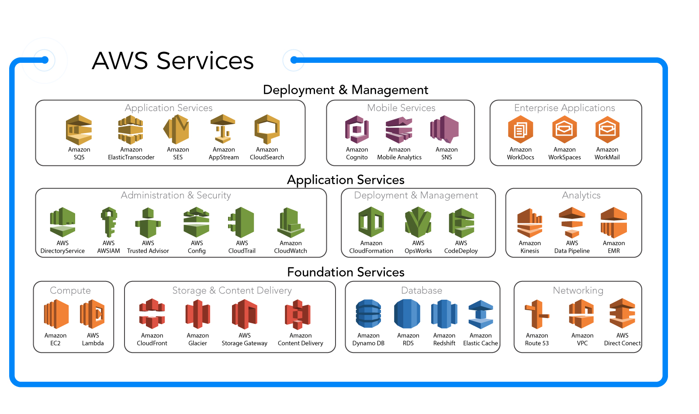

## Amazon Web Service

### Cloud computing

> [Cloud computing](https://en.wikipedia.org/wiki/Cloud_computing) is the on-demand availability of computer system resources, especially data storage and computing power, without direct active management by the user.

**Some cloud computing providers:**
- Amazon with [Amazon Web Service (AWS)](https://aws.amazon.com/)
- Microsoft with [Azure](https://azure.microsoft.com/en-us/)
- Google with [Google Cloud Platform (GCP)](https://cloud.google.com/)
- IBM with [IBM Cloud](https://www.ibm.com/cloud) 
- Alibaba with [Alibaba Cloud](https://www.alibabacloud.com)

**So, what about cloud computing provider in your country?**

### Amazon Web Service

#### The giant on the market

> Amazon Owns Nearly Half Of The Public-Cloud Infrastructure Market Worth Over $32 Billion: Report
>
> [-Forbes-](https://www.forbes.com/sites/jeanbaptiste/2019/08/02/amazon-owns-nearly-half-of-the-public-cloud-infrastructure-market-worth-over-32-billion-report/#4e687fda29e0)

#### What services AWS provides?

#### AWS core service
#####  EC2 & Elastic IP
EC2 is a virtual computer on cloud that you can install and run anything you want. Is usually used to run server side application

It usually attach with an elastic (static) IP

##### Route 53
Use to mapping a domain to EC2 or other AWS service

##### VPC, RDS, DynamoDB
- VPC (Virtual private cloud) can make an private network
- AWS provides some database services such as:
    - RDS: Support Relation database such as MySQL, MS SQL, Oracle, Postgres
    - Dynamo DB: a Non-SQL database 

##### Auto Scaling
Use Auto scaling to increase/decrease size of EC2 instance depend on realtime demand, so it can reduce expense 

##### ELB - Elastic load balancer, Elastic cache
- When system become larger, consider using these 2 services 

##### S3, Cloudfront
- S3: where you can save static files
- Cloudfront: a CDN that serve resource base on location

##### Lambda, SQS, SNS
- Lambda: execute dependency job, also used in serverless architecture
- SQS, SNS: send message to user or other services 

##### Cloud watch, IAM
- IAM: Restrict permission of user
- Cloudwatch: monitoring AWS resource

---
##### AWS Core Services

